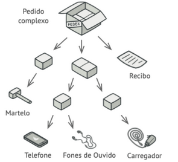
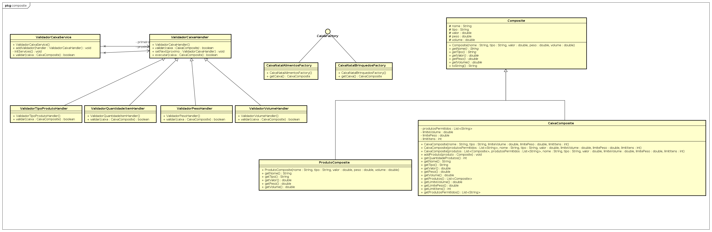

# Atividade Pedido Composite
Atividade da disciplina de padrões de projetos

Implementar o seguinte exemplo:

Considere que as caixas tenham as seguintes restrições que devem ser verificadas com o padrão de projeto Chain of Responsibility:

- Peso máximo (em gramas)
- Volume máximo (em cm3)
- Quantidade máxima de itens
- Tipo de produto (pode conter um determinado tipo de produto ou não pode conter determinado tipo de produto)

## Resolução

